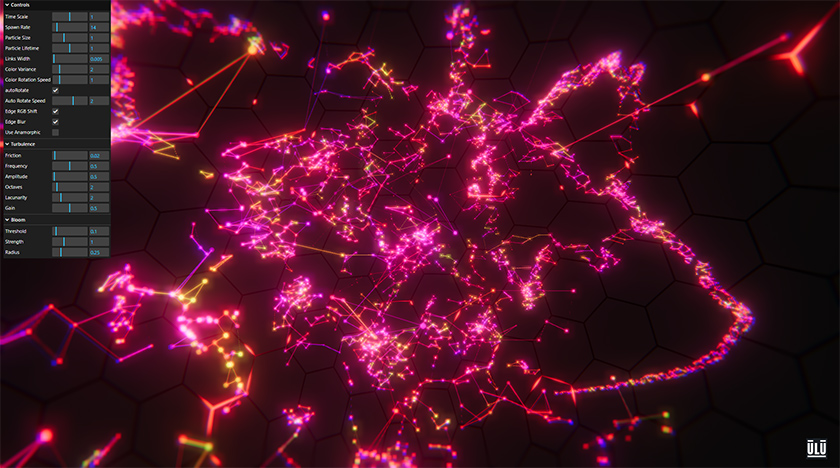

# Linked particles



More experimentation with TSL.

Simple Particles and associated geometry handled in a compute shader with TSL. 

And a lot of post processing with the provided nodes

## Website 

Visit https://ulucode.com/random/webgputests/linked/ to play!
Requires a browser with WebGPU support.

## Where to look 
The important code, regarding TSL [/src/lib/elements/LinkedParticles.ts](https://github.com/ULuIQ12/webgpu-tsl-linkedparticles/blob/main/src/lib/elements/LinedParticles.ts)
The file is commented and uses mostly descriptive variable names.


## Getting Started

To start the development environment for this project, follow these steps:

1. Clone the repository to your local machine:

  ```bash
  git clone https://github.com/ULuIQ12/webgpu-tsl-linkedparticles.git
  ```

2. Navigate to the project directory:

  ```bash
  cd webgpu-tsl-linkedparticles
  ```

3. Install the dependencies:

  ```bash
  npm install
  ```

4. Start the development server:

  ```bash
  npm run dev
  ```

  This will start the development server and open the project in your default browser.

## Building the Project

1. Edit the base path in vite.config.ts

2. To build the project for production, run the following command:

```bash
npm run build
```

This will create an optimized build of the project in the `dist` directory.


## Acknowledgements
- Uses Three.js https://threejs.org/
- Built with Vite https://vitejs.dev/
- UI Management uses LilGui and a bit of React https://react.dev/
- SDF functions and other utilities from Inigo Quilez https://iquilezles.org/

## Resources 
- Three.js WebGPU examples : https://threejs.org/examples/?q=webgpu
- Three.js TSL documentation : https://github.com/mrdoob/three.js/wiki/Three.js-Shading-Language


   